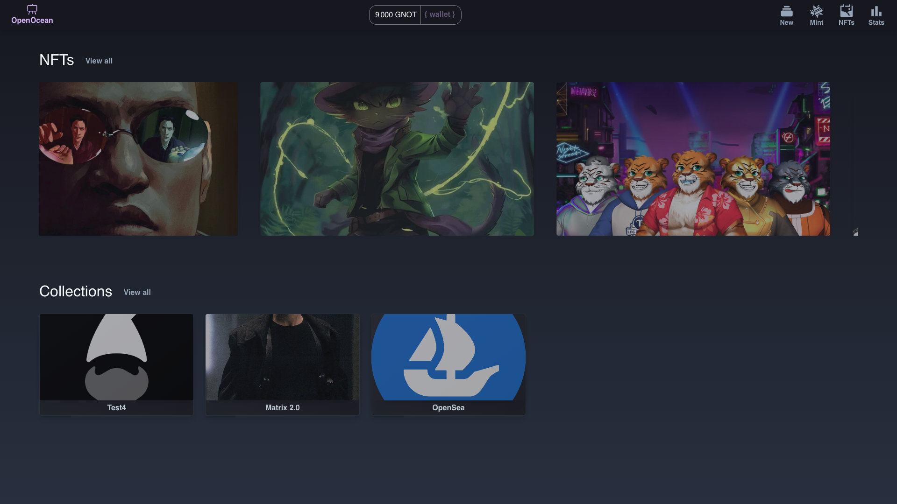
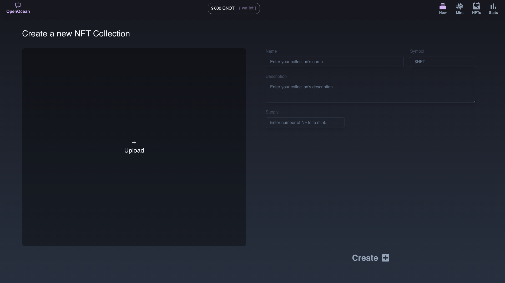
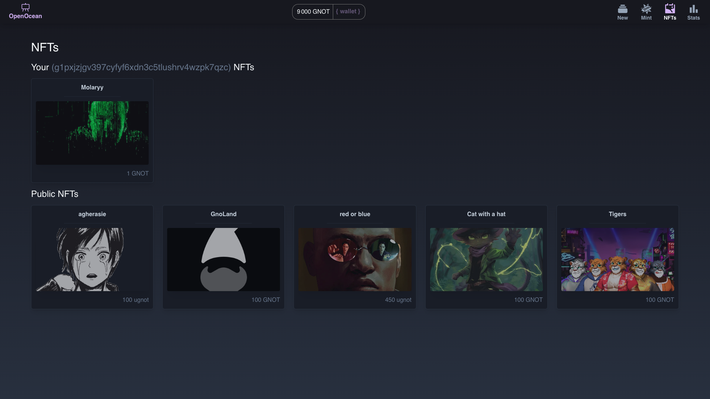
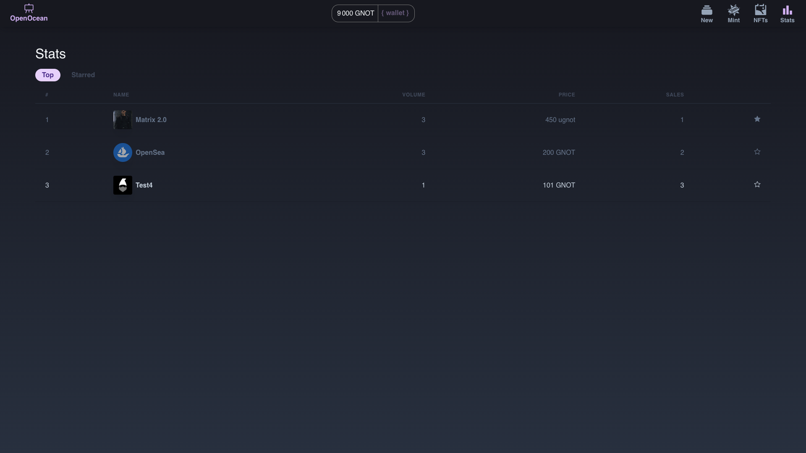

# Openocean

Openocean is a decentralized marketplace similar to [OpenSea](https://opensea.io/), but it differentiates itself by operating on the [gno.land](https://gno.land/) blockchain. This unique integration allows Openocean to leverage the advanced features and capabilities of the gno.land platform, providing users with a secure, efficient, and innovative environment for trading digital assets and collectibles.




## Getting started
### Installation
- [Gno development environment](https://arc.net/l/quote/tbvcmtfj)
- [Bun](https://bun.sh/docs/installation)

### Launch the project locally
Once you finished setting up your gno environment, you will have access to some tools like, [gnodev](https://docs.gno.land/gno-tooling/cli/gno-tooling-gnodev).

```sh
git clone git@github.com:Molaryy/openocean.git
cd openocean
gnodev contract
```

Before launching the frontend donst forget co create a new .env file, for that you can copy the current example one:
```sh
cp .env.dist .env
```
And you will already see some default values, you will need to add a [Pinata](https://www.pinata.cloud/) API key and also a gateway.

To launch the frontend, open a new terminal and use the next commands:
```sh
cd frontend
bun install
bun run dev
```

</br>

## Features :rocket:

### Collection creation


## You own profile


## Statistics


Madte with :heart: by:

| [<br><sub>Alex</sub>](https://github.com/agherasie) | [<br><sub>Mohammed</sub>](https://github.com/molaryy)
|:---:|:---:|
